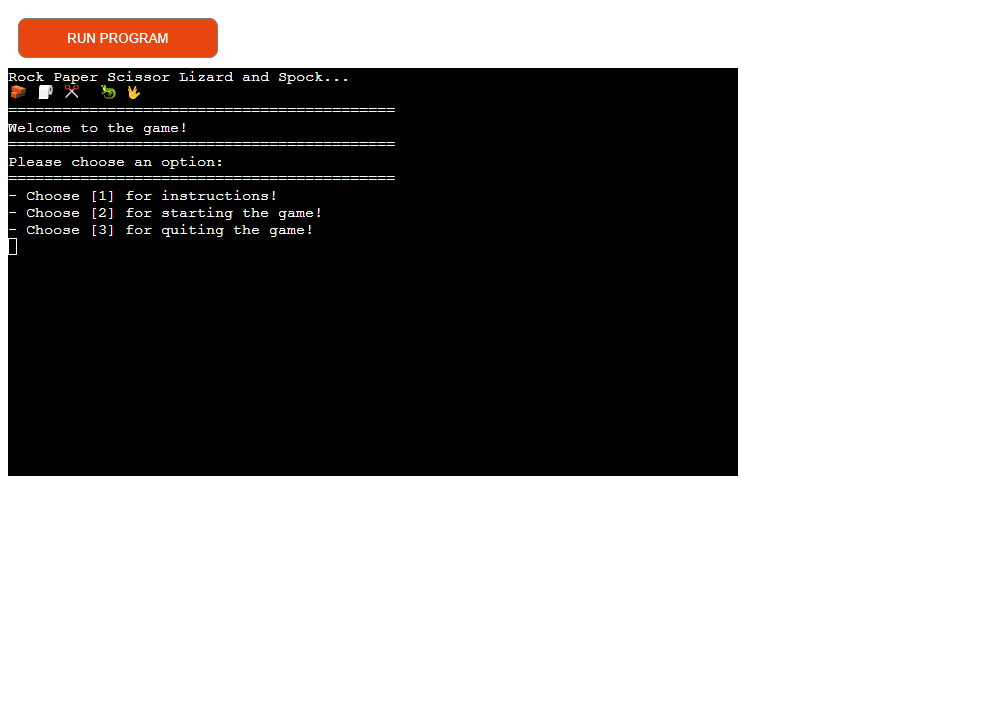
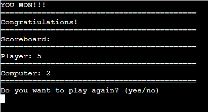
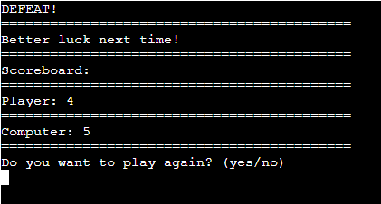
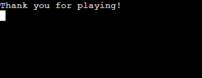
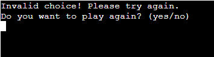
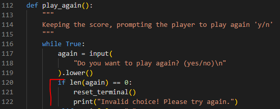
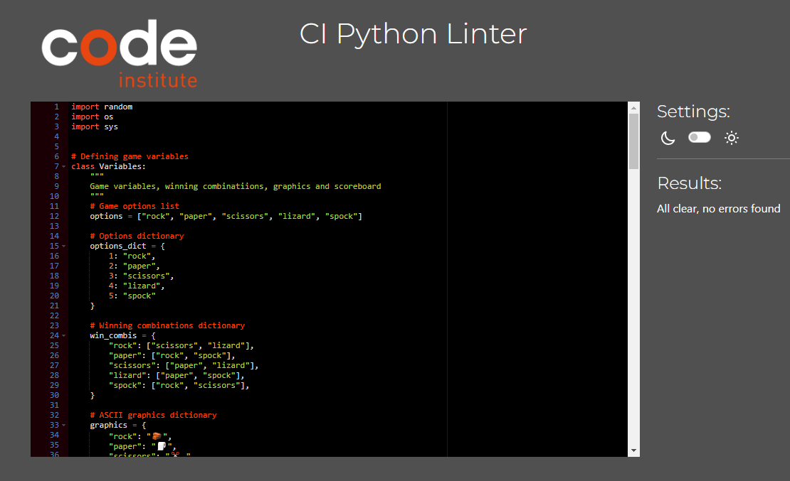
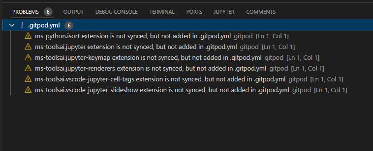

# Rock Paper Scissors Lizzard Spock GAME
- Rock Paper Scissors Lizzard and Spock is aterminal game coded with Python that runs in the Heroku mock terminal provided by Code Institute
- The user will play against the computer up to a score of five, by selecting one of the 5 options (Rock Paper Scissors Lizzard or Spock) and will then be declared the winner or the looser of the game by aa print statement.

- [The live version of the game can be found here!](https://pp3-rpsls.herokuapp.com/)

## How To Play
- Rock Paper Scissors Lizzard and Spock is a variation of the well known Rock Paper Scissors interactive hand game, that is usually played between two people, in which each player simultaneously forms one of three shapes with an outstretched hand. 
- These shapes are "rock", "paper", and "scissors", which in our case will add the two extra elements, "Lizzard" and "Spock".
- The extended variation of the game was made popular by the television show "The Big Bang Theory" which is presented in extenso on [wikiHow](https://www.wikihow.com/Play-Rock-Paper-Scissors-Lizard-Spock).

## Features

### Existing Features
- Game launch menu
	- When "Run Program" is pressed in the Heroku terminal the game is launched and it will display the menu screen with:
	- The game title on top + the representing graphic emojis
	- A welcome message
	- A prompt to choose one of the three options in the Player menu

- Choosing [1] (num key) will display the game rules, as see below

- In order to go back to the main menu the Player will have to press Enter
- Sellecting [2] on the numeric key pad will start the game 

- The user will be prompted to sellect one of the five options (Rock Paper Scissors Lizzard or Spock) either by numeric key or by typing the name of the selected option (not case sensitive)
- Once an option was selected, the computer will generate a random choice against the player and the Scoreboard of the round will be displayed, showing the sellected moves, the score and wether the Player won or lost the round

- In order to continue, the Player will have to hit enter after each round
- Some of the rounds will be a "Draw" which will keep te score the same, so the game will continue until the user or the computer will win the round

- Once the Player reaches a score of 5 against the Computer the end_game function is called printing the winner message! 

- In case the Computer wins the game, a "DEFEAT!" message is printed to the terminal 

- Once a game has ended the user will be prompted to sellect either to keep playing (y/n) or to quit the game
- Selecting "y", will reset the scoreboard and the game will start again from the beginning
- Selecting "n" will exit the game and will print a "Thank you for playing!" message 

- Selecting anythig else than "yes/no" in the end of the game will trigger an error message that will keep the user in a loop untill one of the expected answers is provided

- One small last cool feature that is worth mentioning is the implementation of a favicon that displays a miniature schematic of the 5 choises of the game on the browser tab

### Future Features
- Allow player to input name.
- Allow two human players to play against each other.
- Generate colored text for all the print messages.

## Data Model

- For the game Variables class a series of dictionaries were used, containting integers, strings and string arrays
- The gameplay functions, the score keeping and the endgame prompting loop, involve while loops with boolean statements and if/elif/else statements. 

## Testing
- Passed the code through the PEP8 validator successfully and no errors were returned!
- Tested extensively with the Gitpod terminal in the process of debugging and restructuring the code more efficiently
- Tested the application in the Code Institute Heroku terminal

### Bugs
- A persisten bug that was exiting the game when pressing 'enter' in the end of the game when the player is prompted to play again (y/n).
- The solution for this issue was to add another line of code to the while loop in the play_again function.

### Remaining Bugs
- No bugs remaining

### Validator Test
- PEP8
	- No errors returned when passing the code through PEP8online.com
	- 
- Also in the Gitpod terminal (under the PROBLEMS tab) no errors were returned from the run.py file.
	- 
	- 

## Deployment

Code Institute has provided a [template](https://github.com/Code-Institute-Org/python-essentials-template) to display the terminal view of this backend application in a modern web browser.
This is to improve the accessibility of the project to others.

The live deployed application can be found deployed on [Heroku](https://pp3-rpsls.herokuapp.com).

### Heroku Deployment

This project uses [Heroku](https://www.heroku.com), a platform as a service (PaaS) that enables developers to build, run, and operate applications entirely in the cloud.

Deployment steps are as follows, after account setup:

- Select **New** in the top-right corner of your Heroku Dashboard, and select **Create new app** from the dropdown menu.
- Your app name must be unique, and then choose a region closest to you (EU or USA), and finally, select **Create App**.
- From the new app **Settings**, click **Reveal Config Vars**, and set the value of KEY to `PORT`, and the value to `8000` then select *add*.
- If using any confidential credentials, such as CREDS.JSON, then these should be pasted in the Config Variables as well.
- Further down, to support dependencies, select **Add Buildpack**.
- The order of the buildpacks is important, select `Python` first, then `Node.js` second. (if they are not in this order, you can drag them to rearrange them)

Heroku needs two additional files in order to deploy properly.
- requirements.txt
- Procfile

You can install this project's **requirements** (where applicable) using:
- `pip3 install -r requirements.txt`

If you have your own packages that have been installed, then the requirements file needs updated using:
- `pip3 freeze --local > requirements.txt`

The **Procfile** can be created with the following command:
- `echo web: node index.js > Procfile`

For Heroku deployment, follow these steps to connect your own GitHub repository to the newly created app:

Either:
- Select **Automatic Deployment** from the Heroku app.

Or:
- In the Terminal/CLI, connect to Heroku using this command: `heroku login -i`
- Set the remote for Heroku: `heroku git:remote -a app_name` (replace *app_name* with your app name)
- After performing the standard Git `add`, `commit`, and `push` to GitHub, you can now type:
	- `git push heroku main`

The frontend terminal should now be connected and deployed to Heroku!

### Local Deployment

This project can be cloned or forked in order to make a local copy on your own system.

For either method, you will need to install any applicable packages found within the *requirements.txt* file.
- `pip3 install -r requirements.txt`.

If using any confidential credentials, such as `CREDS.json` or `env.py` data, these will need to be manually added to your own newly created project as well.

#### Cloning

You can clone the repository by following these steps:

1. Go to the [GitHub repository](https://github.com/trikalex/pp3-rpsls-game) 
2. Locate the Code button above the list of files and click it 
3. Select if you prefer to clone using HTTPS, SSH, or GitHub CLI and click the copy button to copy the URL to your clipboard
4. Open Git Bash or Terminal
5. Change the current working directory to the one where you want the cloned directory
6. In your IDE Terminal, type the following command to clone my repository:
	- `git clone https://github.com/trikalex/pp3-rpsls-game.git`
7. Press Enter to create your local clone.

Alternatively, if using Gitpod, you can click below to create your own workspace using this repository.

Please note that in order to directly open the project in Gitpod, you need to have the browser extension installed.
A tutorial on how to do that can be found [here](https://www.gitpod.io/docs/configure/user-settings/browser-extension).

#### Forking

By forking the GitHub Repository, we make a copy of the original repository on our GitHub account to view and/or make changes without affecting the original owner's repository.
You can fork this repository by using the following steps:

1. Log in to GitHub and locate the [GitHub Repository](https://github.com/trikalex/pp3-rpsls-game)
2. At the top of the Repository (not top of page) just above the "Settings" Button on the menu, locate the "Fork" Button.
3. Once clicked, you should now have a copy of the original repository in your own GitHub account!

### Local VS Deployment
- No noticeable differences between the deployed application compared to the local developed one.

## Credits

### Code

- Most of the code generated through the creation of this application was learned in the Python Essentials module
and also through the **Love Sandwiches Walkthrough Project**.
- As a source of inspiration also the following youtube channel was used: [Arjan Codes](https://www.youtube.com/@ArjanCodes)

### Media & Content

- The emoji graphics used in this game were taken from [emojidb.org](https://emojidb.org/rock-emojis)
- [wikiHow](https://www.wikihow.com/Play-Rock-Paper-Scissors-Lizard-Spock) for the game rules and extended explanations

### Platform

- Code institute for the Heroku deployment terminal

### Acknowledgements

- I would like to thank my Code Institute mentor, Tim Nelson for his essential help that made it possible to create and successfully finalize this project!
